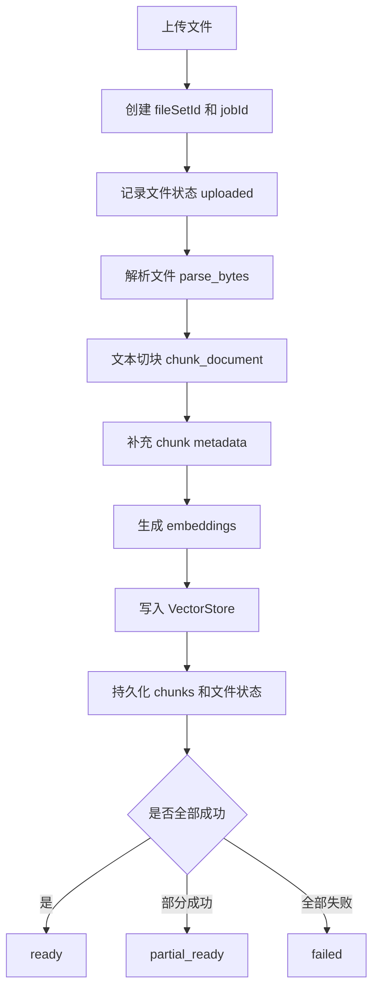
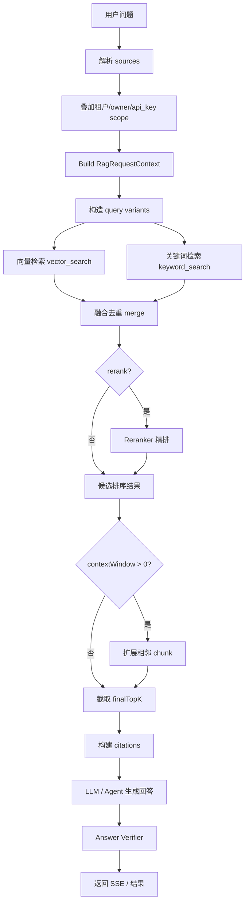

# RAG 技术问答设计文档

本文只覆盖当前项目中的 RAG（Retrieval-Augmented Generation，检索增强生成）能力，不重复 README 中的项目启动、接口总览、环境安装等通用内容。文档目标是把当前 RAG 方案从整体设计到代码实现讲清楚，便于后续评审、调优与扩展 Cross-encoder Reranker。

---

## 1. 一句话理解当前 RAG 方案

当前项目的 RAG 方案可以概括为：

> 用户上传文件或绑定知识库后，系统将文档解析、切块、向量化并索引；问答时在受权限约束的 source 范围内执行多路召回，融合向量检索与关键词检索，必要时进行 query rewrite、multi-query、rerank 和上下文窗口扩展，最后由 Agent/LLM 基于检索证据生成带引用的回答，并通过轻量验证器判断证据是否足够。

核心链路如下：

```text
文档入库：
Upload File
  -> Parse Document
  -> Chunk Text
  -> Embed Chunks
  -> Upsert Vector Store
  -> Persist Metadata / Status

问答检索：
User Query
  -> Resolve Sources / Permission Scope
  -> Build Request Context
  -> Query Rewrite / Multi-query
  -> Vector Search + Keyword Search
  -> Merge / Deduplicate
  -> Optional Rerank
  -> Optional Context Window Expansion
  -> Final Top-K Evidence
  -> LLM / Agent Answer
  -> Citations + Verification + Observability
```

---

## 2. 为什么需要 RAG

普通 LLM 只依赖模型参数回答，容易出现几个问题：

1. **知识滞后**：模型不知道最新上传的文件、内部制度、客户知识库。
2. **无法引用**：回答无法说明依据来自哪个文件、哪个片段。
3. **容易幻觉**：缺少外部证据时，模型可能编造答案。
4. **权限不可控**：用户只能访问哪些文件、知识库，需要由服务端强制约束，而不是靠 prompt 提醒。

RAG 的作用是把“知识查找”从 LLM 参数中分离出来：

```text
LLM 负责：理解问题、组织语言、基于证据回答
RAG 负责：找到可访问、相关、可引用的外部资料
```

因此，本项目的 RAG 设计重点不是简单把文档塞进 prompt，而是建立一套可控的证据链：

- source 范围明确；
- chunk 可追踪；
- 检索分数可观察；
- 引用可返回；
- 低置信度可拒答；
- 后续可以插入更强的 reranker。

---

## 3. 整体模块架构

当前 RAG 相关代码主要分布在：

```text
app/routers/rag.py
  RAG HTTP API 入口，负责上传、状态、知识库、流式问答、SSE、审计与观测。

app/models/rag.py
  RAG 请求、响应、source、option、citation 等 Pydantic 数据模型。

app/services/rag/ingestion.py
  文件入库服务：创建 file set/job、解析文件、切块、embedding、写入向量库、持久化状态。

app/services/rag/parser.py
  文档解析，将上传文件转换为 ParsedDocument。

app/services/rag/chunker.py
  文本切块，生成 RagChunk。

app/services/rag/embeddings.py
  embedding provider 抽象和实现。

app/services/rag/vector_store.py
  向量库抽象、本地向量库、关键词检索、source 权限过滤。

app/services/rag/retriever.py
  检索主流程：query variants、多路召回、融合、rerank、context window、citation。

app/services/rag/reranker.py
  reranker provider 抽象、本地词法 reranker、HTTP cross-encoder reranker 适配器。

app/services/rag/tools.py
  面向 Agent/MCP 的 request-scoped RAG 工具门面。

app/services/rag/tool_executor.py
  执行固定 RAG tool call，并将结果序列化给 LLM。

app/services/rag/pipeline.py
  根据请求构造 RagRequestContext、RetrievalTrace、拒答文案。

app/services/rag/answer_verifier.py
  轻量证据验证与 citation alignment。
```

模块关系可以抽象为：

```text
                    +----------------------+
                    |  app/routers/rag.py  |
                    +----------+-----------+
                               |
                               v
                    +----------------------+
                    | RagStreamRequest     |
                    | RagRequestContext    |
                    +----------+-----------+
                               |
        +----------------------+----------------------+
        |                                             |
        v                                             v
+------------------+                         +--------------------+
| IngestionService |                         | RagAgentRunner /   |
| 文件入库          |                         | Tool Executor      |
+--------+---------+                         +----------+---------+
         |                                              |
         v                                              v
+------------------+                         +--------------------+
| Parser / Chunker |                         | RagToolService     |
| Embedder         |                         +----------+---------+
+--------+---------+                                    |
         |                                              v
         v                                   +--------------------+
+------------------+                         | RagRetriever       |
| VectorStore      |<------------------------| hybrid_search      |
+------------------+                         +----------+---------+
                                                    |
                                  +-----------------+----------------+
                                  |                                  |
                                  v                                  v
                         +----------------+                 +----------------+
                         | Reranker       |                 | AnswerVerifier |
                         +----------------+                 +----------------+
```

---

## 4. 两条主链路：入库链路与问答链路

### 4.1 文档入库链路

文档入库负责把用户文件变成可检索的 chunk。



入库过程中有几个关键 ID：

- `fileSetId`：一次上传形成的文件集合。
- `jobId`：一次入库任务。
- `fileId`：单个文件 ID。
- `chunkId`：单个文本片段 ID。
- `knowledgeBaseId`：持久知识库 ID，可由 file set 晋升得到。

设计上，`file_set` 更像临时上传上下文，`knowledge_base` 更像长期可引用知识库。

### 4.2 问答检索链路

问答链路负责在用户可访问的 source 范围内找到证据，并交给 LLM。



---

## 5. 请求模型与关键参数

RAG 问答请求的核心模型是 `RagStreamRequest`，检索选项是 `RagQueryOptions`。

常见参数含义如下：

| 参数 | 含义 | 设计目的 |
| --- | --- | --- |
| `topK` | 兼容字段，默认检索 TopK | 老接口兼容 |
| `retrieveTopK` | 多路召回候选池大小 | 先多召回，保证相关证据不要过早丢失 |
| `finalTopK` | 最终进入回答的证据数量 | 控制 prompt 长度与证据密度 |
| `hybrid` | 是否启用向量 + 关键词混合检索 | 兼顾语义匹配和精确词匹配 |
| `queryRewrite` | 是否启用本地查询扩展 | 对退款/付款等领域词做确定性扩展 |
| `multiQuery` | 是否启用多查询变体 | 提升召回覆盖率 |
| `rerank` | 是否启用 reranker | 对候选证据重新排序 |
| `rerankProvider` | reranker provider 名称 | 支持 local 或 cross-encoder HTTP |
| `contextWindow` | 是否读取命中 chunk 的邻居 | 补足前后文 |
| `verificationMode` | 验证强度 | 控制回答后证据校验 |
| `abstentionMode` | 证据不足时策略 | 控制是否拒答 |

当前配置默认值中比较重要的是：

```text
RAG_RETRIEVE_TOP_K=100
RAG_FINAL_TOP_K=8
RAG_ENABLE_MULTI_QUERY=true
RAG_RERANK_PROVIDER=local_lexical
RAG_CHUNK_SIZE=1000
RAG_CHUNK_OVERLAP=120
```

这说明当前方案默认偏向“召回优先”：先拿较大的候选池，再在后续阶段压缩为最终证据。

---

## 6. Source 与权限设计

RAG source 类型包括：

```text
knowledge_base
file_set
external_retriever
```

每个 source 有：

```text
type
id
metadata
```

其中 metadata 会承载租户和调用者范围：

```text
tenant_id / tenantId
owner_id / ownerId
api_key_id / apiKeyId
```

服务端在 `app/routers/rag.py` 中会从 HTTP header 或请求 metadata 中提取 scope，并叠加到 sources 上。随后 `VectorStore` 在匹配 chunk 时会检查：

1. chunk 是否属于对应 file set / knowledge base / external source；
2. chunk metadata 中的 tenant、owner、api key 是否与 source metadata 匹配。

这点很重要：权限过滤不是交给 LLM，也不是靠 prompt，而是在检索层执行。

```text
用户请求
  -> 服务端解析 scope
  -> scope 写入 RagSource.metadata
  -> VectorStore._matches_sources
  -> VectorStore._matches_source_permissions
  -> 只有匹配 scope 的 chunk 才能被检索
```

---

## 7. Chunk 设计

文档解析后会经过 `TextChunker` 切成 `RagChunk`：

```text
chunk_id
chunk_index
text
token_count
metadata
source_file_id
```

切块策略具有几个特点：

1. **按段落保留结构**：优先按空行和 Markdown heading 分块，而不是机械按字符截断。
2. **保留 heading path**：Markdown 标题会形成层级路径，便于后续 metadata rerank 和引用展示。
3. **支持 overlap**：相邻 chunk 之间保留一定重叠，降低关键句被切断的风险。
4. **长段落切分**：超过 chunk size 的大块文本会被滑窗切开。
5. **parent text metadata**：对长块切分场景保留 parent 相关信息，便于读取更完整上下文。

当前默认：

```text
chunk_size = 1000
chunk_overlap = 120
```

这属于相对均衡的设置：既避免 chunk 太短导致语义不完整，也避免 chunk 太长导致检索粒度过粗。

---

## 8. Embedding 设计

Embedding 层定义了统一接口：

```text
embed_documents(texts)
embed_query(text)
```

当前有两类 provider：

1. **LocalHashEmbeddingProvider**
   - 用于开发和测试；
   - 无外部依赖；
   - 结果稳定；
   - 不适合生产语义检索质量。

2. **OpenAICompatibleEmbeddingProvider**
   - 调用 OpenAI-compatible `/embeddings` 接口；
   - 由 `RAG_EMBEDDING_MODEL`、`RAG_EMBEDDING_BASE_URL`、`RAG_EMBEDDING_API_KEY` 配置；
   - 适合接入真实 embedding 服务。

入库时：

```text
chunk.text[] -> embed_documents -> embeddings[] -> vector_store.upsert_chunks
```

查询时：

```text
query variant -> embed_query -> query_embedding -> vector_search
```

向量维度一致性由本地向量库做运行时保护。如果已有向量维度与新 embedding 维度不一致，写入会抛出错误；查询相似度计算发现维度不一致时会告警并返回 0 分。

---

## 9. VectorStore 与混合检索

`VectorStore` 是检索存储抽象，主要能力包括：

```text
upsert_chunks
vector_search
keyword_search
delete_file_set
tag_file_set_as_knowledge_base
delete_knowledge_base
get_chunk
list_chunks
```

当前本地实现 `LocalVectorStore` 提供两类检索：

### 9.1 向量检索

向量检索使用 cosine similarity：

```text
score = cosine(query_embedding, chunk_embedding)
```

它擅长处理：

- 同义表达；
- 语义相近但字面不同；
- 自然语言问题到文档片段匹配。

缺点是：

- 对专有名词、编号、精确短语有时不如关键词检索；
- 只能保证语义相似，不保证该 chunk 真能回答问题。

### 9.2 关键词检索

关键词检索使用本地 BM25-style scorer：

```text
query tokens
  -> document frequency
  -> term frequency
  -> BM25-like score
  -> normalized score
```

它擅长处理：

- 文件中的精确术语；
- ID、编号、接口名、政策名；
- 中文单字或英文 token 的直接匹配。

### 9.3 为什么要 hybrid

单独向量检索和单独关键词检索都有盲点。Hybrid 的意义是：

```text
向量召回：找语义相关
关键词召回：找字面强相关
融合排序：保留两者都认为重要的 chunk
```

当前 `RagRetriever._merge_results` 用类似 Reciprocal Rank Fusion 的思想融合：

```text
combined_score = weight * (original_score + 1 / (rank + 60))
```

同一个 chunk 如果同时被向量和关键词命中，会累加分数，并将 `search_type` 标记为 `hybrid`。

---

## 10. Query Rewrite 与 Multi-query

检索前，系统会构造多个 query variants。

### 10.1 Query Rewrite

`rewrite_query` 使用确定性的本地词表扩展，例如：

```text
refund -> return / reimburse / rma
退款 -> 退货 / 返款 / 退款政策
付款 -> 支付 / 账期 / 发票
```

它不是调用 LLM 改写，而是可控的领域词扩展。

优点：稳定、低成本、可解释。

缺点：覆盖范围取决于词表维护。

### 10.2 Multi-query

`build_query_variants` 会在启用 multi-query 时增加：

- token 拼接版；
- 前几个 token；
- query 前半部分。

目的是在用户问题较长时，避免因为完整 query 太具体而漏掉关键 chunk。

示例：

```text
原问题：退款流程中如果客户没有发票怎么处理

可能 variants：
1. 退款流程中如果客户没有发票怎么处理
2. 退款流程中如果客户没有发票怎么处理 退货 返款 退款政策
3. 退款 流程 中 如果 客户 没有 发票 怎么 处理
4. 退款
5. 流程
...
```

每个 variant 都会分别执行向量检索和关键词检索，最后合并。

---

## 11. Reranker 设计

Reranker 是当前 RAG 架构中最适合继续增强的部分。

当前流程是：

```text
vector / keyword / hybrid 多路召回
  -> merge 得到 candidate_k 个候选
  -> reranker 对候选重新排序
  -> finalTopK 截断给 LLM
```

### 11.1 现有 LocalLexicalReranker

当前默认 provider 是：

```text
local_lexical
```

它基于以下因素加分：

1. query token 与 chunk text token overlap；
2. query token 与 metadata 中 filename、heading、sourceName 等 overlap；
3. query 原句是否在 chunk text 中精确出现；
4. 原始检索分数。

它的优点是：

- 无外部依赖；
- 可作为 fallback；
- 对精确词匹配有帮助。

它的限制是：

- 本质仍是词法规则，不是真正理解 query-chunk 关系；
- 对“主题相似但不能回答问题”的 chunk 过滤不够强；
- 对复杂中文语义、长句意图、业务流程判断能力有限。

### 11.2 CrossEncoderHttpReranker

项目已经预留 HTTP cross-encoder 适配器：

```text
provider = cross_encoder_http
base_url = RAG_RERANK_BASE_URL
endpoint = POST /rerank
```

请求语义是：

```json
{
  "query": "用户问题",
  "documents": ["候选 chunk 1", "候选 chunk 2"],
  "topK": 8
}
```

返回语义是：

```json
{
  "results": [
    { "index": 3, "score": 0.91 },
    { "index": 0, "score": 0.86 }
  ]
}
```

如果 HTTP 服务不可用或返回格式异常，会 fallback 到 `LocalLexicalReranker`。

### 11.3 为什么 Cross-encoder 有价值

双塔 embedding 检索是：

```text
query -> vector
chunk -> vector
cosine similarity
```

Cross-encoder reranker 是：

```text
[query, chunk] -> 同一个模型联合编码 -> relevance score
```

双塔适合大规模召回，cross-encoder 适合小候选集精排。推荐组合是：

```text
召回 top-50 / top-100
  -> Cross-encoder rerank
  -> final top-5 / top-8
```

对于 `BAAI/bge-reranker-v2-m3` 这类模型，收益主要体现在：

- 中文/英文/中英混合文档相关性判断更准；
- 减少主题相似但证据不足的 chunk；
- 提升 finalTopK 的证据密度；
- 改善 citation alignment；
- 降低 LLM 幻觉概率。

### 11.4 推荐默认配置

如果启用 cross-encoder，建议分三档：

```text
高质量：retrieveTopK=100, finalTopK=8, rerank=true
平衡：  retrieveTopK=50,  finalTopK=5, rerank=true
低延迟：retrieveTopK=20,  finalTopK=5, rerank=true
```

生产默认建议从平衡档开始：

```text
RAG_RETRIEVE_TOP_K=50
RAG_FINAL_TOP_K=5
RAG_RERANK_PROVIDER=cross_encoder_http
RAG_RERANK_BASE_URL=http://your-reranker-service
```

---

## 12. Context Window 设计

Rerank 后，系统可根据 `contextWindow` 扩展相邻 chunk。

假设命中：

```text
chunk_index = 10
contextWindow = 1
```

则会读取：

```text
chunk 9, chunk 10, chunk 11
```

这样做是为了解决：

- 命中 chunk 只包含结论，前一个 chunk 包含定义；
- 命中 chunk 只包含步骤中间部分，后一个 chunk 包含例外条件；
- Markdown 文档中标题和正文被切到相邻 chunk。

当前策略是：

1. 先对 anchor chunk 排序；
2. 再读取相邻 chunk；
3. 邻居 chunk 分数设置为 anchor score 的 0.5；
4. 最后统一排序并截断。

这个策略简单可靠。后续可以优化为 evidence packing：围绕 top anchor 成组组织上下文，而不是把所有 chunk 扁平排序。

---

## 13. Citation 与 Answer Verification

### 13.1 Citation

检索结果会被转换为 `RagCitation`：

```text
sourceId
sourceName
chunkId
page
quote
score
metadata
```

引用片段默认截取 chunk 前 240 字符。metadata 中会包含：

```text
sourceFileId
chunkIndex
searchType
```

这样前端或调用方可以知道：

- 回答来自哪个文件；
- 使用了哪个 chunk；
- 是向量命中、关键词命中、hybrid 命中、rerank 后命中还是 context 扩展。

### 13.2 Answer Verifier

`RagAnswerVerifier` 是轻量规则验证器，不调用额外模型。它计算三类分数：

1. `retrieval_confidence`
   - 看 top result 与 query token overlap；
   - 看 top score；
   - 看结果数量；
   - hybrid 命中有 provenance bonus。

2. `citation_alignment_score`
   - 看 citation quote 是否真的来自对应 result；
   - 看 answer token 与 quote token 的重叠。

3. `answer_support_score`
   - 看 answer token 在全部 evidence 中是否有支撑。

最终 confidence 组合为：

```text
0.35 * retrieval_confidence
+ 0.35 * citation_alignment_score
+ 0.30 * answer_support_score
```

如果证据不足，会产生 reason：

```text
no_retrieval_results
weak_retrieval_match
citation_alignment_below_threshold
answer_not_supported_by_evidence
```

这些 reason 会被映射为用户可读的拒答原因。

---

## 14. Agent / Tool 调用设计

项目不是只支持“服务端预检索后直接拼 prompt”，还支持通过 Agent 调用 RAG 工具。

RAG 工具有四类：

```text
rag_hybrid_search
rag_read_chunk
rag_list_sources
rag_get_file_outline
```

这些工具由 `RagToolExecutor` 执行，最终委托给 `RagToolService`。

关键设计点：

1. 工具调用必须带 `RagRequestContext`；
2. `RagRequestContext` 中包含 sources、topK、permissions；
3. 工具层会对 topK、retrieveTopK、finalTopK、contextWindow 做边界约束；
4. `read_chunk` 也会检查 chunk 是否属于当前 request scope；
5. Agent 不能越权读取不在 source 范围内的 chunk。

这意味着即使 LLM 试图请求任意 chunk，服务端工具层也会做权限过滤。

---

## 15. 两种问答入口

当前路由中有两个主要流式入口：

```text
POST /rag/stream
POST /agent-sdk/rag/stream
```

它们都属于 RAG 问答，但定位不同。

### 15.1 `/rag/stream`

偏 RAG-only：

- 使用 RAG 系统提示词；
- allowed tools 限制为 RAG MCP 工具；
- 适合标准知识库问答。

### 15.2 `/agent-sdk/rag/stream`

偏 Agent SDK primary path：

- RAG MCP + 原生 Skills 能力；
- allowed tools 为空表示 Skills 全开；
- 适合同时需要 RAG 文档和项目环境能力的问题。

二者共同点：

1. 都会解析 sources；
2. 都会叠加 scope；
3. 都会构建 `RagRequestContext`；
4. 都会通过 `RagAgentRunner` 和 tool executor 执行。

---

## 16. Observability 与 Trace

项目中已经有 `RetrievalTrace`，记录检索过程：

```text
query
variants
retrieveTopK
finalTopK
stages
```

检索阶段会写入：

```text
variant_retrieval
merge
rerank
context_expansion
final
```

此外路由层还有 query observability，会记录：

- query_id / request_id；
- source_scope；
- retrieval_top_k；
- retrieve_top_k；
- final_top_k；
- matched_chunks；
- citation_count；
- confidence；
- abstained；
- latency_ms；
- tool calls；
- usage daily。

这些数据对后续 RAG 调优非常关键，尤其是启用 cross-encoder 后，需要比较：

```text
无 rerank vs local_lexical vs cross_encoder_http
top1 hit rate
topK hit rate
citation alignment
abstention rate
average latency
fallback rate
```

---

## 17. 从代码角度串起完整流程

下面按一次“用户上传文件并问答”的顺序串联代码。

### 17.1 上传与入库

入口在 `app/routers/rag.py`。路由会：

1. 校验 API key；
2. 解析 multipart 上传文件；
3. 从 header/metadata 提取 scope；
4. 调用 `rag_ingestion_service.enqueue_ingestion_job` 或 `ingest_files`；
5. 后台执行 `run_ingestion_job`。

入库主服务在 `RagIngestionService`：

```text
enqueue_ingestion_job
  -> 创建 fileSetId/jobId
  -> 初始化 FileSetRecord
  -> 创建 RagFileInfo
  -> 持久化 file/job 状态

run_ingestion_job
  -> 标记 running/parsing
  -> 对每个文件调用 _ingest_single_file
  -> 汇总 ready/partial_ready/failed
```

单文件入库 `_ingest_single_file`：

```text
parsing
  -> parser.parse_bytes

chunking
  -> chunker.chunk_document
  -> _apply_chunk_metadata

embedding
  -> embedder.embed_documents

indexing
  -> vector_store.upsert_chunks
  -> _persist_mysql_chunks
```

### 17.2 创建知识库

如果用户要把一次 file set 晋升为长期知识库，调用：

```text
create_knowledge_base_from_file_set
```

它会：

1. 检查 file set 是否 ready 或 partial_ready；
2. 生成 `knowledge_base_id`；
3. 调用 `vector_store.tag_file_set_as_knowledge_base` 给 chunk metadata 打标签；
4. 记录 KnowledgeBaseRecord；
5. 持久化知识库元数据。

### 17.3 问答请求进入路由

流式问答入口会先做 source 解析：

```text
_resolve_request_sources
```

它支持：

- 显式 `sources`；
- `knowledgeBaseId`；
- `fileSetId`；
- `knowledgeBaseName`；
- `knowledgeBaseNames`。

如果用户传知识库名称，会调用 ingestion service 解析名称到 ID。

然后：

```text
_apply_scope_to_sources
build_request_context
_active_rag_agent_runner
stream_claude_sdk
```

### 17.4 构建 RagRequestContext

`build_request_context` 会把请求参数转换成上下文：

```text
requestId
conversationId
sources
activeFileSetId
topK
permissions
```

permissions 中包含：

```text
retrieveTopK
finalTopK
hybrid
queryRewrite
multiQuery
rerank
rerankProvider
contextWindow
verificationMode
abstentionMode
minConfidence
```

这一步的意义是：把“本次请求允许怎么检索”固化下来，后面的工具执行都基于它。

### 17.5 Agent 调用 RAG 工具

当 Agent 调用 `rag_hybrid_search` 时，进入：

```text
RagToolExecutor.execute
```

它会从 tool input 和 context permissions 中解析参数，并调用：

```text
RagToolService.hybrid_search
  -> RagRetriever.search
  -> RagRetriever.hybrid_search
```

工具执行结果会序列化为：

```text
chunkId
sourceFileId
chunkIndex
text
score
searchType
metadata
```

然后交还给 LLM。

### 17.6 Retriever 检索主流程

`RagRetriever.hybrid_search` 是检索核心：

```text
final_k = final_top_k or top_k
candidate_k = max(retrieve_top_k or settings.rag_retrieve_top_k, final_k)
variants = build_query_variants(...)

for variant in variants:
    query_embedding = embedder.embed_query(variant)
    vector_results += vector_store.vector_search(..., top_k=candidate_k)
    keyword_results += vector_store.keyword_search(..., top_k=candidate_k)

results = _merge_results(vector_results, keyword_results, top_k=candidate_k)

if rerank:
    results = build_reranker(...).rerank(query, results, top_k=candidate_k)

if context_window > 0:
    results = expand_results_with_context(...)

return results[:final_k]
```

这是整套 RAG 的核心算法流程。

### 17.7 生成引用与验证

检索结果可以通过：

```text
RagRetriever.build_citations
```

转换为 citation。

回答生成后，验证器执行：

```text
rag_answer_verifier.verify_answer
```

如果结果不足，则通过：

```text
structured_abstention_answer
abstention_reason_labels
```

生成结构化拒答文案。

---

## 18. 当前方案优点

当前 RAG 方案已经具备比较完整的生产化雏形：

1. **检索链路完整**：入库、向量化、检索、引用、回答都有。
2. **支持 hybrid**：不是纯向量，兼顾关键词精确匹配。
3. **支持 multi-query**：能提升复杂问题召回率。
4. **source 权限可控**：检索层做租户/owner/api key 过滤。
5. **reranker 插槽已存在**：可低侵入接入 cross-encoder。
6. **context window 已存在**：能补足相邻上下文。
7. **verification 已存在**：可以对低证据回答进行拦截。
8. **observability 已存在**：具备后续 A/B 和调参基础。

---

## 19. 当前方案限制

也有一些明显可以继续增强的点：

1. **默认 reranker 仍是词法规则**
   - `local_lexical` 只能基于 token overlap 加分；
   - 对复杂语义判断能力有限。

2. **本地向量库适合 MVP，不适合大规模生产**
   - 当前 `LocalVectorStore` 是内存实现；
   - 大规模知识库应切换 Qdrant、Milvus、pgvector 等外部向量库。

3. **query rewrite 词表有限**
   - 当前是确定性领域词表；
   - 可维护，但覆盖面取决于业务积累。

4. **answer verifier 是轻量规则，不是模型级 verifier**
   - 能发现一部分低质量回答；
   - 不能完全替代 NLI/LLM judge。

5. **context expansion 后没有二次 evidence packing**
   - 邻居 chunk 以 anchor score * 0.5 参与排序；
   - 后续可以按 section/document 分组组织上下文。

---

## 20. Cross-encoder Reranker 增强建议

推荐把 Cross-encoder Reranker 作为下一阶段重点增强。

### 20.1 目标链路

```text
query
  -> vector + keyword 召回 top-50/top-100
  -> merge 去重
  -> BAAI/bge-reranker-v2-m3 精排
  -> finalTopK=5/8
  -> context window expansion
  -> LLM answer
```

### 20.2 推荐模型

```text
BAAI/bge-reranker-v2-m3
```

原因：

- 多语言能力强；
- 中文场景适配较好；
- query-passage relevance 质量明显高于词法规则；
- 适合自部署，避免用户文档发送给第三方。

### 20.3 接入方式

因为当前已有 `CrossEncoderHttpReranker`，所以服务端 RAG 主体不需要大改，只需要提供兼容 HTTP 服务，并设置：

```text
RAG_RERANK_PROVIDER=cross_encoder_http
RAG_RERANK_BASE_URL=http://your-reranker-service
```

### 20.4 调优建议

先做三组对比：

```text
A: rerank=false
B: rerank=true, provider=local_lexical
C: rerank=true, provider=cross_encoder_http
```

观测指标：

- top1 hit rate；
- topK hit rate；
- citation alignment score；
- answer support score；
- abstention rate；
- 平均延迟；
- P95 延迟；
- reranker fallback 次数；
- 单次 query rerank document 数量。

---

## 21. 推荐生产默认策略

### 21.1 平衡质量与延迟

```text
retrieveTopK=50
finalTopK=5
hybrid=true
queryRewrite=true
multiQuery=true
rerank=true
rerankProvider=cross_encoder_http
contextWindow=0 或 1
verificationMode=standard
abstentionMode=insufficient_context
```

### 21.2 高质量模式

```text
retrieveTopK=100
finalTopK=8
contextWindow=1
rerank=true
```

适用于：

- 法务/政策/制度类文档；
- 回答必须高准确率；
- 延迟可以接受。

### 21.3 低延迟模式

```text
retrieveTopK=20
finalTopK=5
contextWindow=0
rerank=true
```

适用于：

- 高频客服问答；
- 文档库较小；
- 对响应速度敏感。

---

## 22. 典型问题解答

### Q1：为什么不是直接把所有文档塞给 LLM？

因为上下文窗口有限，成本高，且无权限和引用控制。RAG 通过检索只选择最相关证据，能降低 token 成本并提升可解释性。

### Q2：为什么需要 keyword search，向量检索不够吗？

不够。向量检索适合语义相似，但对编号、接口名、政策名、精确短语有时不稳定。关键词检索能补足这些场景。

### Q3：为什么需要 reranker？

召回阶段目标是“不要漏”，排序阶段目标是“排得准”。Embedding 双塔召回不擅长细粒度判断 query-chunk 是否真的构成答案关系，cross-encoder reranker 能显著提升 finalTopK 质量。

### Q4：为什么 retrieveTopK 要大于 finalTopK？

因为召回阶段需要给后续 rerank 留候选。如果一开始只召回 top-5，真正相关的 chunk 一旦排在第 8、第 20，就永远没有机会被 reranker 提升。

### Q5：contextWindow 应该开多大？

一般建议 0 或 1。过大容易引入噪声和增加 prompt token。只有在文档结构强依赖前后文时才考虑 2 或 3。

### Q6：证据不足时为什么要拒答？

RAG 的目标是基于资料回答。如果检索不到可靠证据，强行回答会增加幻觉风险。拒答并提示补充资料比编造答案更安全。

---

## 23. 后续演进路线

建议按优先级推进：

```text
P0: 接入 cross_encoder_http reranker，优先 bge-reranker-v2-m3
P0: 增加 reranker latency、fallback、doc_count 观测字段
P1: 建立 RAG eval case 集，比较 no-rerank/local/cross-encoder
P1: 将默认 retrieveTopK 从 100 视延迟调为 50，finalTopK 调为 5
P1: 对 context window 后的 evidence packing 做分组优化
P2: 引入更强 answer verifier，例如 NLI/LLM judge
P2: 对外部向量库进行生产化替换和容量压测
P2: 优化 query rewrite，从静态词表扩展为可配置领域词典
```

---

## 24. 总结

当前 RAG 方案已经形成较完整的技术闭环：

```text
文件入库
  -> chunk
  -> embedding
  -> vector/keyword hybrid retrieval
  -> merge
  -> rerank 插槽
  -> context expansion
  -> citations
  -> answer verification
  -> observability
```

它的架构优势是模块边界清晰、source 权限可控、可观测性较好，并且已经为 Cross-encoder Reranker 留好了低侵入扩展点。

下一步最有价值的增强是把默认的 `local_lexical` reranker 升级为真实 cross-encoder reranker，例如 `BAAI/bge-reranker-v2-m3`，采用：

```text
retrieveTopK=50/100
  -> cross-encoder rerank
  -> finalTopK=5/8
```

这样能在不大改现有架构的前提下，显著提升最终证据质量、引用可靠性和回答准确率。
